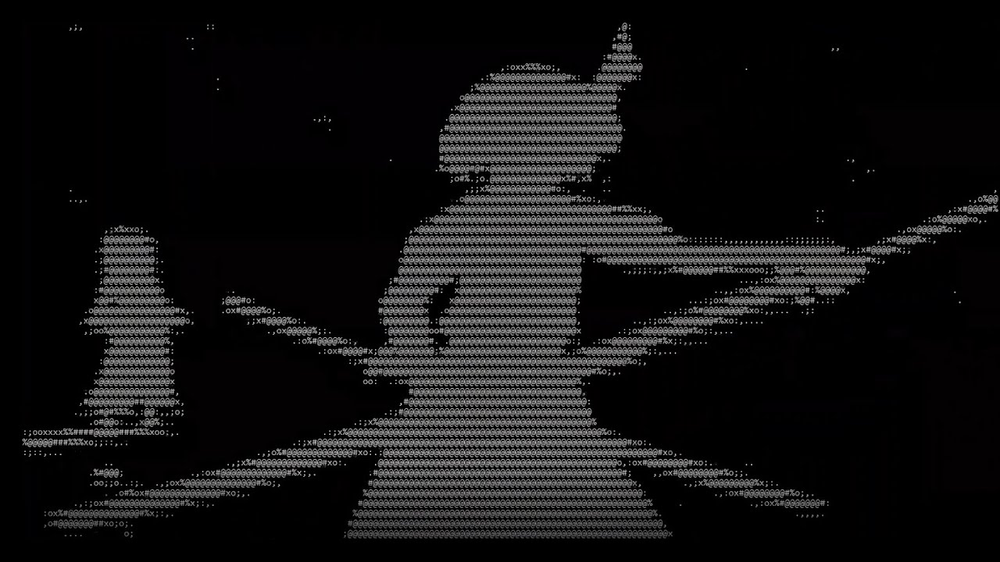

# Vid2Ascii

Vid2Ascii converts any video supported by OpenCv cv::VideoCapture to ASCII characters. Since Multi-Threading support has been added, it means we can view any video in real-time.

### Possible errors
If for some reason, the console displays no ascii converted frames then check the progress bar. If the progress bar does not display the '#' behind '=', then it is possible that your video is playing faster than the computer has time to convert your video frames. 
  - To resolve this issue try adding more threads, by typing 'y' to "resize output"
  - Or set "Using threads" to 0. The only problem with this is you are not going to be viewing the converted video in real-time.

### Notes
- There's an exe file in case you do not want to compile my code.
- There is no audio support.
- [Reference] (https://stackoverflow.com/questions/32987103/image-to-ascii-art-conversion)

### Bad Apple

https://www.youtube.com/watch?v=a1omROIEgd8
